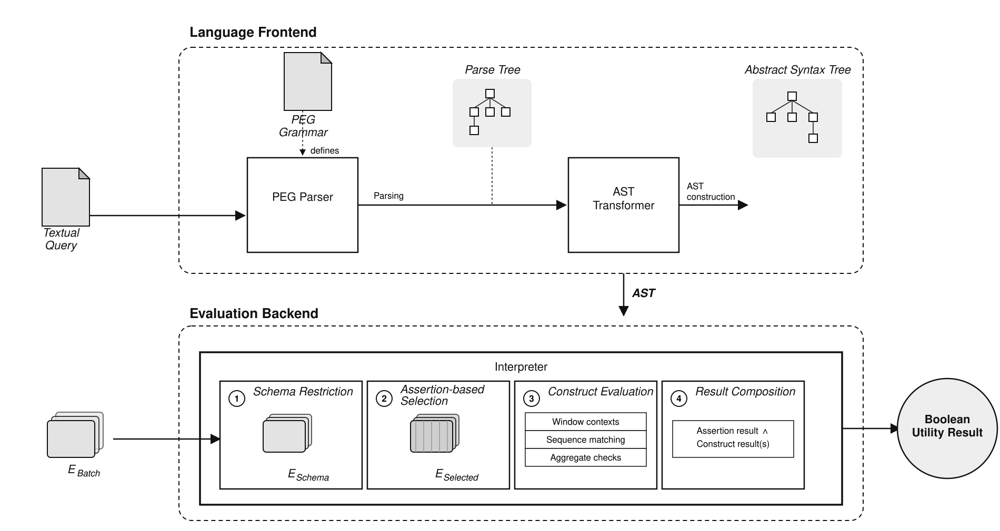

# Data Utility Attestation — End-to-End System

<!-- TODO: one-line thesis title / author / university -->

An implementation of a zero-knowledge **data utility attestation** protocol.

Data consumers express utility requirements over a data batch as a query in
a custom DSL (referred to in the code as **EPL**); the query is evaluated
against the private batch inside a [RISC Zero](https://risczero.com) zkVM
guest, producing a receipt that proves the evaluation result without
revealing the raw data.

## Protocol overview

The demo (`host`) walks through six phases, matching the roles in the
protocol:

1. **Batch provisioning** — the Manufacturer signs a data batch (RSA).
2. **Utility rule generation** — the Data Consumer trains a decision tree
   over labelled data and derives a utility predicate from it.
3. **Preprocessing** — the User (data holder) parses the predicate into an
   EPL AST and indexes the raw batch.
4. **Proof generation** — the User runs the AST + batch + signature through
   the zkVM guest (`methods/guest`) and gets back a receipt.
5. **Verification** — the Data Consumer verifies the receipt, checks the
   committed predicate matches what was requested, and checks the
   Manufacturer's signature is intact.
6. **Purchase decision** — based on the verified result.

> **Note:** `scripts/end-to-end-test.sh` runs this protocol on CPU with a
> single small workload (`user-batch.json`) purely to **illustrate** the
> six phases above. It is not the thesis's evaluation methodology. The
> actual evaluation runs — larger workloads (10MB/100MB/1000MB), real ZK
> proofs, GPU-accelerated — are done via
> `scripts-cuda/end-to-end-test-cuda.sh` on a CUDA-capable machine; see
> "Real evaluation runs" below.

## Repository layout

| Path                        | What it is                                                               |
| --------------------------- | ------------------------------------------------------------------------ |
| `crates/dnf_core`           | EPL parser AST + interpreter (the DSL language itself)                   |
| `crates/system_core`        | Manufacturer / Data Consumer protocol logic                              |
| `host`                      | Orchestrates the end-to-end demo (`host/src/main.rs`)                    |
| `methods` / `methods/guest` | The zkVM guest program (`eval_ast`) that evaluates the EPL AST privately |
| `benchmarks`                | Test-data generation + benchmark result recording                        |
| `scripts`                   | CPU demo/smoke-test scripts                                              |
| `scripts-cuda`              | Bare-metal GPU setup + the real evaluation/benchmark scripts             |

## Quick start (Docker — recommended)

On Linux / x86-64:

```bash
docker build -t dua-e2e .

docker run -it --rm dua-e2e
```

On Apple Silicon (`M1`, `M2`, `M3`, etc.), build the image explicitly for
`linux/amd64`:

```bash
docker build --platform=linux/amd64 -t dua-e2e .

docker run -it --rm dua-e2e
```

Inside the container:

```bash
# just the DSL language-expressiveness suite (host/src/unit_tests_expressiveness.rs,
# module `lang_expressiveness_tests`) — parses and evaluates queries across
# quantifiers, value types, DNF combinations, every aggregate function, and
# time-windows
cargo test -p host --lib lang_expressiveness_tests

# fast smoke test (dev mode, small fixed dataset)
bash scripts/test.sh

# CPU demonstrator only — illustrates the protocol, not the real evaluation
bash scripts/end-to-end-test.sh
```

> **Apple Silicon note:** Docker execution was tested on a MacBook Air with
> an Apple M3 chip and 8 GB RAM. The smaller smoke-test and demonstrator
> workloads worked, but larger real-proof workloads may exceed the memory
> available to Docker on an 8 GB system. For larger proof-generation runs,
> a machine with more RAM is recommended.

See [`DOCKER.md`](DOCKER.md) for more detail.

## Quick start (without Docker)

Requires [`rustup`](https://rustup.rs) (picks up the pinned toolchain from
`rust-toolchain.toml` automatically) and the RISC Zero toolchain:

```bash
curl -L https://risczero.com/install | bash

rzup install

cargo run -p host --release -- user-batch.json
```

Dev mode (fast, no real proof) is controlled by `RISC0_DEV_MODE=1|0`.

## Real evaluation runs (not covered by the Docker image)

The thesis's actual end-to-end evaluation runs on larger workloads
(10MB/100MB/1000MB datasets) with GPU acceleration, via
`scripts-cuda/end-to-end-test-cuda.sh`, plus two dedicated large-workload
runs: `scripts-cuda/extensive-bechmark-100MB.sh` and
`scripts-cuda/extensive-bechmark-1000MB.sh`. This is the branch that owns
these high-workload runs (as opposed to `dsl-performance-benchmarks`,
which stays in the 1KB–1000KB range).

All of these require an NVIDIA GPU, the CUDA toolkit, and driver support
on the host machine — see `scripts-cuda/set-up.sh` for bare-metal setup.
They cannot run inside this container, since the NVIDIA driver must live
on the host. Recorded results from these runs are committed under
`benchmarks/benchmark_results/`.


## DSL implementation

The custom DSL referenced above — internally called **EPL** — is implemented
on the [`end-to-end-system`](../../tree/end-to-end-system) branch, under
[`crates/system_core`](../../tree/end-to-end-system/crates/system_core) (parsing)
and [`crates/dnf_core`](../../tree/end-to-end-system/crates/dnf_core) (AST +
interpreter):

| Component | Path | Description |
| --- | --- | --- |
| Grammar | [`epl-dsl.pest`](../../blob/end-to-end-system/crates/system_core/src/epl-dsl.pest), [`dnf.pest`](../../blob/end-to-end-system/crates/system_core/src/dnf.pest), [`common.pest`](../../blob/end-to-end-system/crates/system_core/src/common.pest) | [PEST](https://pest.rs) grammar rules defining the DSL surface syntax. |
| Parser | [`parser.rs`](../../blob/end-to-end-system/crates/system_core/src/parser.rs) (`parse_source`) | Combines the PEST lexical parsing of the grammar above with the AST transformation into a `ProgramAst`. |
| Data model — program/rules | [`epl.rs`](../../blob/end-to-end-system/crates/dnf_core/src/epl.rs) | The `ProgramAst` structure plus schema, assertion/pattern rule, window and session types. |
| Data model — terms/predicates | [`ast.rs`](../../blob/end-to-end-system/crates/dnf_core/src/ast.rs) | Core term/predicate types (`Operator`, `Term`, `Pred`) and the DNF (disjunctive normal form) `Conjunction`/`Disjunction` structures matched by `dnf.pest`. |
| Interpreter | [`interpreter.rs`](../../blob/end-to-end-system/crates/dnf_core/src/interpreter.rs) (`eval_program`) | Evaluates a parsed `ProgramAst` (the canonical utility predicate) against an event batch `Vec<Event>`. |

`eval_program(p: &ProgramAst, input: &Vec<Event>) -> bool` is the interpreter's
entry point: it takes the AST produced by `parse_source` and a batch of
`Event`s, and returns whether the batch satisfies the encoded utility
predicate. The diagram below shows how a query flows from the language
frontend (grammar → PEG parser → AST transformer) into the interpreter's
evaluation stages:




## GPU (CUDA) setup

Based on the [RISC Zero](https://github.com/risc0/risc0) documentation (an
older commit — verify against the current RISC Zero docs before relying on
this for a fresh setup).

```bash
# NVIDIA driver tooling + driver
sudo apt install ubuntu-drivers-common
sudo ubuntu-drivers install

# build dependencies
sudo apt install build-essential libssl-dev -y

# CUDA toolkit
sudo apt install cuda-toolkit -y

# Rust
curl --proto '=https' --tlsv1.2 -sSf https://sh.rustup.rs | sh

# CUDA paths
echo 'export PATH=/usr/local/cuda/bin:$PATH' >> ~/.bashrc
echo 'export LD_LIBRARY_PATH=/usr/local/cuda/lib64:$LD_LIBRARY_PATH' >> ~/.bashrc
source ~/.bashrc

# RISC Zero
git clone https://github.com/risc0/risc0.git
cd risc0

cargo install --force --path risc0/cargo-risczero
cargo risczero install

# GPU benchmark / test
RUSTFLAGS="-C target-cpu=native" cargo run -F cuda -r --example datasheet
```

> **Note:** depending on your machine's GPU model, kernel version, and
> distro, further driver-specific configuration beyond the steps above may
> be necessary (e.g. secure boot / kernel module signing, a specific
> NVIDIA driver branch, or additional CUDA compatibility packages). The
> [NVIDIA CUDA Toolkit](https://developer.nvidia.com/cuda/toolkit) must
> also be installed/set up separately (not covered in detail here).

## License

See [`LICENSE`](LICENSE).
